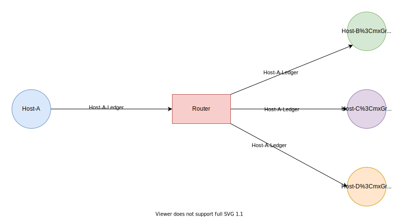

# Rebuilding Apple's Seamless Headphone Switch with Kotlin MultiPlatform

The inspiration for this project came from this tweet.

<blockquote class="twitter-tweet" style="width: 100%" width="100%" height="100%">
<p lang="en" dir="ltr">AirPods will now automatically switch between devices by recognizing if you put down your phone and pick up your iPad. Or if you’re on your iPad and you get a phone call, it’ll switch back to the phone. That’s the type of experience only a complete ecosystem can create.</p>&mdash; Marques Brownlee (@MKBHD) <a href="https://twitter.com/MKBHD/status/1275122690618261511?ref_src=twsrc%5Etfw">June 22, 2020</a>
</blockquote>
<script async src="https://platform.twitter.com/widgets.js" charset="utf-8"></script>


Obviously, this is


A core tenet of the iOS community is that Apple's products "just work" and that other platforms don't have a "complete ecosystem". Even with the fragmentation issues encompassing other platforms, the previous statement is downright falsehood.

> Fun fact: There are 1,300 brands with over 24,000 distinct Android devices ([source](https://www.android.com/everyone/)).

## Terminology

1. **Peripheral**: Refers to Bluetooth audio devices (headphones, headsets, earbuds, etc), keyboards, mice, etc.
2. **Host**: A machine capable of connecting to a peripheral. Eg: phones, tablets, laptops, etc.

# Overview

**PCAS (Peripheral Connection Augmentation System)** artificially augments the number of simultaneous connections a Bluetooth peripheral can handle. Based on user initiated events and hardware configurations PCAS automatically connects/disconnects a profile on a peripheral (headphone, keypad, mouse, etc). PCAS can also multiplex to a single sink: For example, on Android, this brings the theoretical maximum audio connections to 30 ([the maximum allowed AudioTrack instances](https://groups.google.com/g/android-platform/c/_tmA8DRg8q4)).

Basically, a single user with multiple devices (phones, tablets, & laptops) no longer have to manually connect/disconnect each device. PCAS does this automatically. Example scenarios:

1. When a call comes in on your phone while watching a movie on your tablet. The movie is automatically paused and your phone is connected. (This works even on cheap audio devices that don't support multiple concurrent connections natively).
2. When playing music from multiple devices, the output could be muxed to the same audio sink in realtime.
3. Putting your laptop to sleep while powering on your desktop will connect your keyboard/mouse to your desktop.

...

## Product

PCAS is designed to be simple and "just work". The only setup required is selecting a peripheral for each service of interest.


All hosts **must** be on the same local connection. E2E encryption is provided but optional (disabled by default). To enable E2E encryption, a key needs to be created and shared with the relevant devices.


> The target user has at most one peripheral per service. This simplifies the UX and technical design.

### Demo
<!-- blank line -->
<div style="position:relative;padding-bottom:56.25%;">
 <iframe style="width:100%;height:100%;position:absolute;left:0px;top:0px;"
 frameborder="0" width="100%" height="100%" 
 allowfullscreen allow="accelerometer; autoplay; clipboard-write; encrypted-media; gyroscope; picture-in-picture"
 src="https://www.youtube.com/embed/WMmtQLNYF-g">
</iframe>
</div>
<!-- blank line -->

## Design Goals

1. **Multi-platform** (Windows, Mac, iOS, Android).
2. Supports **any** bluetooth peripheral (including and especially low-end peripherals).
3. Average switching latency should be **< 1s**. Low-end peripherals or hosts are expected to have a right skewed distribution.
4. Can support at least **10 devices** without any service degradation.
5. **Secured zero-config offline P2P** communication.
6. Negligible **power consumption**.

# Architecture

While building PCAS is hard, the concept it is based on is quite simple:

1. Observe the relevant host states.
2. Share the state with all hosts in a network.
3. Listen for state changes from other hosts.
4. Write all state info to a ledger.
5. Make a decision to connect/disconnect/stream based on the ledger.

This is the project architecture at a high-level:


## Unreliable Zero-Config Transport

This base layer provides a framework for fast, best-effort, [zero-configuration](https://en.wikipedia.org/wiki/Zero-configuration_networking), & E2E encrypted communication among devices within proximity.

Basically, this allows a host to be able to efficiently send and receive messages from other nearby devices without any upfront configuration.

The "unreliable" prefix is actually misleading, just like when people say UDP is unreliable. This layer is just as reliable as the network stack below it; No additional reliability gurantees are provided.

The layer data unit is called a `parcel`. Parcels are opaque: Besides destination information, nothing can easily be extracted from them.

This layer is made of three core components:

i. **MulticastChannel**

This uses [IP multicast](https://en.wikipedia.org/wiki/IP_multicast) to efficiently deliver messages to multiple devices.



An interface is created in the common module which is implemented natively on each platform:

```kotlin
internal interface MulticastChannel {

	@Throws(Exception::class)
	fun init(receiver: MessageReceiver)

	@Throws(Exception::class)
	fun send(parcel: ByteArray, size: Int)

	fun close()
}
```

All hosts can send message to the PCAS group and can join the group to receive messages. This way individual host don't need to care about the actual IP address of each host on the LAN. The multicast configs can be found in the `TransportConfig` class:

```kotlin
internal object TransportConfig {

	// Max value: Messages could potentially leak to the internet.
	const val MULTICAST_TTL = 255
	const val MULTICAST_PORT = 49137
	val MULTICAST_ADDRESS = Address.Ipv4("225.139.089.176")

	const val OFFSET_ZERO = 0

	const val MAX_PARCEL_SIZE_BYTES = 24 * 1024 // 24KB
	const val PARCEL_POOL_CAPACITY = 24
}
```

ii. **UnicastChannel**

This uses [IP unicast](https://en.wikipedia.org/wiki/Unicast) to offer a high-bandwidth bi-directional channel for point-to-point communication. This is used for one-to-one communication and where high speed low-delay data transfer is needed (multicast messages are transmitted at a lower rate).

```kotlin
internal interface UnicastChannel {

	@Throws(Exception::class)
	fun init(receiver: MessageReceiver)

	@Throws(Exception::class)
	fun send(recipient: HostInfo, parcel: ByteArray, size: Int)

	@Throws(Exception::class)
	fun getPort(): Port

	fun close()
}
```

iii. **Parceler**

This component adds E2E encryption to the two channels. Encryption is optional and is only activated when an encryption key is generated or shared.

Data is encrypted with AES in GCM mode with no padding. A random initialization vector is used per message and prepended to the head of the parcel. I won't go into much details here as there are lots of good material on AES encryption on the internet: [like this one](https://levelup.gitconnected.com/doing-aes-gcm-in-android-adventures-in-the-field-72617401269d).


## Immutable Distributed Ledger

This layer is split into two:

i. **Observability & Persistence**
A ledger is just a simple in-memory database of the current state of the active hosts in a network.

```kotlin
data class Ledger(
	val self: HostInfo,
	val blocks: Set<Block> = emptySet()
)
```

A ledger is made of blocks. Each block is uniquely identified by a 4-tuple (service, profile, owner, and peripheral).

```kotlin
data class Block(
	val service: Service,
	val profile: Service.Profile,
	val peripheral: Peripheral,
	val priority: Int,
	val timestamp: Long,
	val bondSteadyState: PeripheralBond.State,
	val owner: HostInfo,
	val canStreamData: Boolean,
	val canHandleDataStream: Boolean
)
```

Blocks can be overwritten only by their owner. So "immutable" isn't techically correct. Host can prune their ledgers to remove blocks from hosts that are no longer active.

ii. **Network Protocol**
A resilient multicast protocol is built on top the prior transport layer. There are four types of messages:

1. Genesis: The first message a host sends, requesting other hosts to send their current blocks.
2. Update: This is sent each time the blocks on a host changes. This message contains all self blocks (the blocks from the current host).
3. Heartbeat: This is periodically sent. After multiple missed heartbeats, a host is deemed dead and all it's block are independently deleted on each local ledger. A host can also detect if it's block are outdated on the remote host based on the content on this message.
4. Ack: This acknowledges that an essential message has been received.

Currently, only `Update` messages are classified as essential. Essential messages have a monotonically increasing sequence number. The initial sequence number is `0`. All host are expected to send an `Ack` message with the sequence number of the essential message.

Reliable multicasting is an interesting problem. Using `ACKs` like TCP isn't scalable and runs the risk of [ACKs implosion](https://courses.cs.washington.edu/courses/cse561/01sp/lectures/568.multicast2.pdf). Although, heartbeat messages are used as a form of `NACK`, the interval is too long that they are not practically useful during high interactivity.

Because most users will have at most 5 hosts, `ACK implosion` while possible, won't have a significant consequence. So `ACKs` with retries were added. Retries are done with a truncated exponential backoff with jitter. The worst case is that 5 devices are each sending (4 + 1) messages of < 200 bytes every x seconds.

The layer data unit is a `Message`.

## Resource Allocation

When two or more host use a service profile, a contention occurs. This means that even if a host doesn't actively require a profile, it can still contend with another host for that profile.

This is the meat or vegetable (for my vegeterian friends) of the system. First, what are profiles?

### Bluetooth Profiles

>A Bluetooth profile is a specification regarding an aspect of Bluetooth-based wireless communication between devices. It resides on top of the Bluetooth Core Specification and (optionally) additional protocols - [source](https://en.wikipedia.org/wiki/List_of_Bluetooth_profiles)
1. **A2DP (Advanced Audio Distribution Profile)**: This is uni-directional audio profile and provides better audio quality than the headset profiles.
2. Headset (Headset Profile/Hands-Free Profile): This is bi-directional audio profile usually use for calls.
3. HID (Human Interface Device Profile): Provides support for devices such as mice, joysticks, keyboards, and simple buttons and indicators on other types of devices. It is designed to provide a low latency link, with low power requirements. PlayStation 3 controllers and Wii remotes also use Bluetooth HID.

Each time a change is made to the local ledger, a resolver looks at all the current contentions and makes a resolution.

### Type of resolutions

1. Connect: The current host should connect to the profile on the peripheral if disconnected.
2. Disconnect: The current host should disconnect from the profile on the peripheral if connected.
3. Stream: The current host should start sending all it's data to the remote host.
4. Ambiguous: No resolution was arrived at. The system should be kept as is.

Resolutions are derived using a rank associated with each block.

### Calculating ranks

```kotlin
	val isConnected = bondSteadyState == PeripheralBond.State.CONNECTED

	val hasPriority = priority != NO_PRIORITY

	val maxPossibleConnectionAndInteractiveScore = 4 + 2

	// Any device with a higher priority should always rank higher.
	val priorityScore = (maxPossibleConnectionAndInteractiveScore + 1.0).pow(priority)

	private val connectionScore: Int get() {
		// Connection should contribute more if we can't stream
    val trueValue = if(canStreamData) 2 else 4
    return if(isConnected) trueValue else 1
	}

	val interactiveScore = if(owner.isInteractive) 2 else 1

	val timestampScore = log10(timestamp.toDouble())

	val rank = priorityScore + connectionScore + interactiveScore + timestampScore
```

The rank is an estimate of the current importance of a block. Based on ranks, a contention object is created for each block a host has.

```kotlin
data class Contention(
	val selfBlock: Block,
	// This is another block with same service, peripheral, and profile but a different owner that is deemed the apex based on its rank
	val peersApexBlock: Block?
)
```

This object is then used to derive a resolution.

```kotlin
fun getResolution(contention: Contention): Resolution {
	return when {
		// No contenders found yet.
		contention.peersApexBlock == null -> {
			Resolution.Connect(contention.selfBlock, contention.selfBlock.rank)
		}

		// I have a higher rank: So connect to profile
		contention.selfBlock.rank > contention.peersApexBlock.rank -> {
			Resolution.Connect(contention.selfBlock, contention.selfBlock.rank)
    }

		// I have a lower rank: So disconnect from profile - If connected
		contention.selfBlock.rank < contention.peersApexBlock.rank -> {
			val rank = contention.peersApexBlock.rank
			// If possible stream data to the apex host
			if(contention.shouldStreamToApex()) {
				Resolution.Stream(contention.selfBlock, rank, contention.peersApexBlock.owner)
			} else {
				Resolution.Disconnect(contention.selfBlock, rank)
			}
		}

		// Nothing decided: Keep the system as-is.
		contention.selfBlock.rank == contention.peersApexBlock.rank -> {
			Resolution.Ambiguous(contention.selfBlock, contention.selfBlock.rank)
		}

		else -> throw IllegalStateException("Impossible!")
	}
}
```


## User Services

Currently only audio services are supported. Provision has been made to easily add other type of services like: mouse, keypad, health, etc.

### Audio

All services can easily be split into two:

i. **Blocks Emission**

```kotlin
data class AudioProperty(val usages: Set<Usage>) {

    enum class Usage(
        val priority: Int,
        val profile: PeripheralProfile
    ) {
        UNKNOWN(1, PeripheralProfile.A2DP),
        // Unknown media playback. It could be music, movie soundtracks, etc.
        MEDIA_UNKNOWN(2, PeripheralProfile.A2DP),
        // Music playback, eg: Music streaming, local audio playback, etc.
        MUSIC(2, PeripheralProfile.A2DP),
        // Speech playback, eg: Podcasts, Audiobooks, etc
        SPEECH(2, PeripheralProfile.A2DP),
        // Soundtrack, typically accompanying a movie or TV program.
        MOVIE(4, PeripheralProfile.A2DP),
        // Game audio playback
        GAME(4, PeripheralProfile.A2DP),
        // Such as VoIP.
        VOICE_COMMUNICATION(5, PeripheralProfile.HEADSET),
        // Telephony call
        TELEPHONY_CALL(6, PeripheralProfile.HEADSET)
    }
}
```

```kotlin
data class PeripheralBond(
    val profile: PeripheralProfile,
    val hotState: State
) {

    enum class State {
        CONNECTED,
        CONNECTING,
        DISCONNECTED,
        DISCONNECTING;

        fun getSteadyState(): State {
            return when(this) {
                CONNECTED -> CONNECTED
                CONNECTING -> DISCONNECTED
                DISCONNECTED -> DISCONNECTED
                DISCONNECTING -> CONNECTED
            }
        }
    }
}
```


ii. **Resolution Handler**

This is where the connection/disconnection/streaming kicks off.

## FAQ

### State of the union

- [x] Create robust architecture
- [x] Build Android Client
- [ ] Complete streaming support
- [ ] Finish switch smoothener
- [ ] Build iOS client
- [ ] Build MAC client
- [ ] Build Windows client
- [ ] Battle testing

### Why use IP Multicast?

Multicast has issues: It requires all devices to be on the same network, it is blocked by some routers. PCAS was designed to be used in a "home network" where these issues don't usually exist.

I explored 2 other possible technologies:

> [Wi-Fi Aware](https://www.wi-fi.org/discover-wi-fi/wi-fi-aware) and [Wi-Fi Direct](https://www.wi-fi.org/discover-wi-fi/wi-fi-direct) were not considered due to power consumption concerns. Google Nearby service was considered, but quickly eliminated due to some unacceptable limitations.

### 1. Push Messaging


This is easy using a service like [FCM](https://firebase.google.com/docs/cloud-messaging) (it would be similar to Google [Nearby Messaging API](https://developers.google.com/nearby/messages/overview) without the proximity part).

FCM and other push messaging services wor using long lived TCP sockets. A TCP socket on the device waits in accept mode on a Google server.

### Pros:

1. Simple.
2. Efficient: We only delivers to the relevant hosts.
3. Works well on Android in the background.

### Cons:

1. Not P2P: Depends on a central device
2. Requires the internet.
3. Higher latency.
4. Increased attack surface: A local only solution limits who can initiate an attack.

### 2. BLE (Bluetooth Low Energy) Advertisement

BLE devices can broadcast advertisement packets unidirectionally.

### How it works:

BLE is fascinating, I would suggest reviewing the [Bluetooth Core Specification v4.0](https://www.bluetooth.org/docman/handlers/downloaddoc.ashx?doc_id=229737). Comprehensively covering how BLE advertisement works will require multiple long articles. I would do a quick summary, conveying key concepts (you can follow the links for more details)

**Physical Layer**

BLE uses the same [2.4Ghz ISM band](https://en.wikipedia.org/wiki/ISM_band) as classic Bluetooth and WiFi.

It operates in the same spectrum range (`2.400–2.4835 GHz`) as Classic Bluetooth, but has `40 2-Mhz channels` as opposed to the classic `79 1-Mhz channels`.

Data is transmitted within a channel using [Frequency Shift Keying](https://en.wikipedia.org/wiki/Frequency-shift_keying#Gaussian_frequency-shift_keying).

The data rate is `1 Mbps` (supporting 2Mbps on Bluetooth 5.0).

**Advertisement Packet**


**Advertising & Interference**

BLE connections are fucking robust, using [frequency hopping](https://en.wikipedia.org/wiki/Frequency-hopping_spread_spectrum) to work around interference.

BLE uses 3 dedicated channels for advertisement: 37, 38, 39 (channels are zero indexed). These channels are spread across the 2.4GHz band so as to minimize interference problems (as can be seen in the image below).


[Image source](https://www.argenox.com/library/bluetooth-low-energy/ble-advertising-primer/)

A relevant study: [Coexistence and Interference Tests on a Bluetooth Low Energy Front-End](https://www.researchgate.net/publication/265602069_Coexistence_and_Interference_Tests_on_a_Bluetooth_Low_Energy_Front-End).

In a nutshell: A peripheral device broadcast advertisement packets on at least 1 of the 3 channels, with a repetition period called the `advertisement interval`.

A scanning central device listens on these channels to detect advertisement packets.

**Advertisement Interval & Scanning**

Page 2223 of the [Bluetooth Core Specification v4.0](https://www.bluetooth.org/docman/handlers/downloaddoc.ashx?doc_id=229737) explains advertisement intervals perfectly.


A scanning device listens on the advertisement channels for a duration called the `scan window`, which is repeated every `scan interval`.

**Discovery latency**

We can use the three parameters: advertising interval, scan interval and scan window to build a probabilistic model for discovery latency. Any such model will be practical flawed without considering the environment where devices will likely be used in.

Obviously, shorter intervals and a higher scan window leads to faster discovery times while consuming more power.

**Power consumption**

Ignore the knee jerk reaction that advertisement must be power hungry. BLE advertisement is power efficient.

Have a look at this [Android power consumption test](https://developer.radiusnetworks.com/2015/12/09/battery-friendly-beacon-transmission.html).

A study by beacon software company Aislelabs reported that peripherals such as proximity beacons usually function for 1–2 years powered by a `1,000mAh coin cell battery`.


### Pros

1. Local & standalone: No LAN requirements.
2. Fast, reliable and power efficient.

### Cons

1. Shorter distance: WiFi usually have 10x more range.
2. Unidirectional flow.
3. Scanning is expensive.