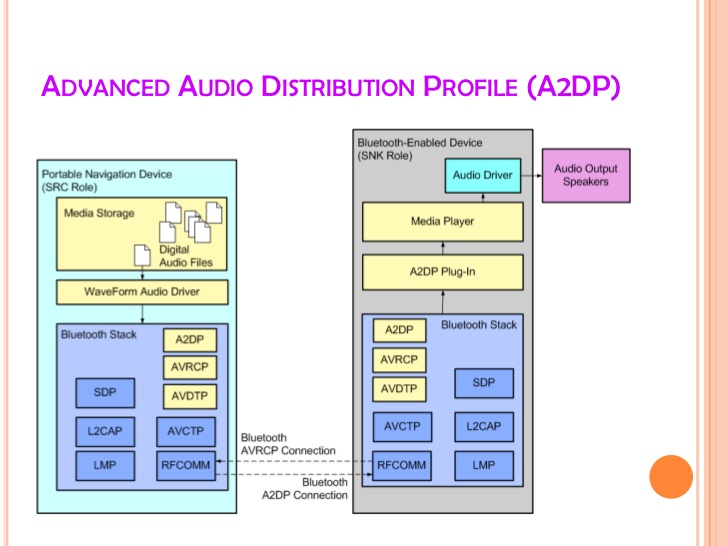

# Rebuilding Apple's Seamless Headphone Switch Feature with Kotlin MultiPlatform

The inspiration for this project came from this tweet.

[](https://twitter.com/MKBHD/status/1275122690618261511)

A core tenet of the Apple camp is that their complete ecosystem makes every product "just work". This is a truism: Apple isn't plagued with fragmentation issues like other platforms. But replicating these functionalities on other platforms isn't rocket science.

> Fun fact: There are 1,300 brands with over 24,000 distinct Android devices ([source](https://www.android.com/everyone/)).
> 

## Terminology

1. **Peripheral**: Refers to Bluetooth audio devices, keyboards, mice. Eg: headphones, headsets, earbuds, etc.
2. **Host**: Refers to a machine capable of connecting to a peripheral. Eg: phones, tablets, laptops, etc.


## Overview

**PCAS (Peripheral Connection Augmentation System)** artificially augments a Bluetooth peripheral maximum number of concurrent connections. Based on user-initiated events and hardware configurations PCAS automatically connects/disconnects a profile on a peripheral. PCAS can also multiplex to a single sink: For example, on Android, this brings the theoretical maximum audio connections to 30 ([the maximum allowed AudioTrack instances](https://groups.google.com/g/android-platform/c/_tmA8DRg8q4)).

Basically, a single user with multiple hosts no longer has to manually connect/disconnect each peripheral. PCAS does this automatically. This works even on cheap peripherals that don't support multiple concurrent connections natively. Example scenarios:

1. When a call comes in on your phone while watching a movie on your tablet. The movie is automatically paused and your phone is connected.
2. When playing music from multiple devices, the output could be muxed to the same audio sink in realtime.
3. Putting your laptop to sleep while powering on your desktop will connect your keyboard/mouse to your desktop.
...


### Building

1. `pcas-libs` directory: This is a KMP Gradle project. It can be opened in IntelliJ or any supported IDE. The clients use the artifacts from this project. Run the `publish_local.sh` script to publish the library artifacts to your maven local repo.
2. `pcas-clients/pcas-android-client` directory: This is an Android Gradle project. Open it up in Android Studio or any supported IDE.

You can find prebuilt binaries in the [release section](https://github.com/Elvis10ten/pcas/releases).

### Design Goals

1. **Multi-platform** (Windows, Mac, iOS, Android).
2. Supports **most** Bluetooth peripheral (including and especially low-end peripherals).
3. Average switching latency should be **< 1s**.
4. Can support at least **10 devices** without any service degradation.
5. **Secure zero-config offline P2P** communication.
6. Negligible **power consumption**.

### Product

PCAS is designed to be simple and "just work". The only initial setup required is selecting a peripheral for each service of interest.


All hosts **must** be on the same LAN. E2E encryption is provided but optional (disabled by default). To enable E2E encryption, a key needs to be created and shared with the relevant hosts.


#### Assumptions

1. Users have at most one peripheral per service. This assumption simplifies the UX and technical design.

#### Demo

[](https://www.youtube.com/watch?v=WMmtQLNYF-g/)

## Architecture

Building PCAS for all platforms is hard, but the underlying concept is quite simple:

1. Each host independently observes local state changes.
2. When a local change occurs, a host broadcasts it to a closed network of peers.
3. Each host independently listens for broadcasts from peers.
4. Each host writes all state information to a local ledger.
5. Each host independently makes a decision to connect/disconnect/stream based on the content of the local ledger.

Project architecture at a high-level:


### Unreliable Zero-Config Transport

This base layer provides a framework for fast, best-effort, [zero-configuration](https://en.wikipedia.org/wiki/Zero-configuration_networking), & E2E encrypted communication among devices within proximity.

This allows a host to be able to efficiently & securely send and receive messages from other nearby devices without any upfront configuration.

The "unreliable" prefix is misleading, just like when people say UDP is unreliable. This layer is just as reliable as the network stack below it; No additional reliability guarantees are provided.

The transport data unit is a `parcel`. Parcels are just opaque byte buffers.

This layer is made of three core components:

#### i. MulticastChannel

This channel uses [IP multicast](https://en.wikipedia.org/wiki/IP_multicast) to efficiently deliver parcels to multiple devices.


```kotlin
internal interface MulticastChannel {

    @Throws(Exception::class)
    fun init(receiver: MessageReceiver)

    @Throws(Exception::class)
    fun send(parcel: ByteArray, size: Int)

    fun close()
}
```

All hosts can send a parcel to the PCAS multicast group and can join the group to receive parcels. Hosts don't need to care about the actual IP address of each discrete host on the LAN. The multicast configs can be found in the `TransportConfig` class:

```kotlin
internal object TransportConfig {

    // Max possible TTL value: Parcels could potentially leak to the internet.
    const val MULTICAST_TTL = 255
    const val MULTICAST_PORT = 49137
    val MULTICAST_ADDRESS = Address.Ipv4("225.139.089.176")

    const val OFFSET_ZERO = 0

    const val MAX_PARCEL_SIZE_BYTES = 24 * 1024 // 24KB
    const val PARCEL_POOL_CAPACITY = 24
}
```

#### ii. UnicastChannel

This channel uses [IP unicast](https://en.wikipedia.org/wiki/Unicast) to offer a high-bandwidth point-to-point communication. This is used for data streaming as multicast has a lower data transfer rate.


```kotlin
internal interface UnicastChannel {

    @Throws(Exception::class)
    fun init(receiver: MessageReceiver)

    @Throws(Exception::class)
    fun send(recipient: HostInfo, parcel: ByteArray, size: Int)

    @Throws(Exception::class)
    fun getPort(): Port

    fun close()
}
```

#### iii. Parceler

This component adds E2E encryption to the two channels above. Encryption is optional and is only activated when an encryption key is generated or shared.

Data is encrypted with AES in GCM mode with no padding. A random initialization vector is used once per message and prepended to the head of a parcel. I won't go into details here as there are lots of good material on AES encryption on the internet: [like this one](https://levelup.gitconnected.com/doing-aes-gcm-in-android-adventures-in-the-field-72617401269d).


An interface is created for the 3 components above in the common module which is implemented natively on each platform.

### Immutable Distributed Ledger

This layer is broadly split into two:

#### i. Ledger
A ledger is just a simple in-memory local database of the current state of the active hosts in a network. A ledger is made of blocks. Each block is uniquely identified by a `4-tuple (service, profile, owner, and peripheral)`.


```kotlin
data class Ledger(
    val self: HostInfo,
    val blocks: Set<Block> = emptySet()
)
```

```kotlin
data class Block(
    val service: Service,
    val profile: Service.Profile,
    val peripheral: Peripheral,
    val priority: Int,
    val timestamp: Long,
    val bondSteadyState: PeripheralBond.State,
    val owner: HostInfo,
    val canStreamData: Boolean,
    val canHandleDataStream: Boolean
)
```

"immutable" isn't technically correct. Blocks can be overwritten ONLY by their **owner**. Any host can prune their ledgers to remove blocks from inactive hosts.

#### ii. Network Protocol

A resilient multicast protocol is built on top of the transport layer. There are three types of messages:

1. **Genesis**: The first message a host sends, requesting other hosts to send their current blocks.
2. **Update**: This is sent each time the blocks on a host changes. This message contains all self blocks (the blocks from the current host).
3. **Heartbeat**: This is periodically sent. After multiple missed heartbeats, a host is deemed dead by its peers and all its block could be independently deleted on each ledger.

Each host maintains its local ledger. The network protocol guarantees that eventually, all ledgers will be consistent.

##### Multicast Reliability

Currently, only **Update** messages are classified as essential.

**Heartbeat** messages are used as a form of [NACKs](https://en.wikipedia.org/wiki/Acknowledgement_(data_networks)). A host detects synchronization issues from heartbeats and resends its current blocks.

While heartbeats are effective, the interval is too long to be relied on primarily for a highly interactive system like PCAS.

Reliable multicasting is an interesting problem. We explore two strategies:

###### a. Using redundancy
Blindly resend essential messages `x` times with a delay of `y + random jitter` for each attempt.

Let's consider a simple model. If the probability of successfully delivering a message is fixed at 0.50. Assuming each attempt is independent, there is a 0.97 probability that at least one message gets delivered in 5 attempts.

> **Napkin math**
> 
> Let b = 1 on success; 0 on failure
> 
> Pr(b = 1) = 0.50
> 
> Pr(b = 0) = 1 - Pr(b = 1) = 0.50
> 
> (b is a benoulli random variable)
>
>
> n = 5
> 
> z = n tries of b
> 
> (z is a binomial random variable)
> 
>
>
> Could also be calculated as 1 - Pr(z = 0)

In practice, delivery probabilities aren't fixed and attempts are not independent. Despite the shortcoming of this approach, it has the following benefits:

1. It isn't dependent on the size of the network. Whether there are 2 or 10,000 peers, a host will only send its messages at a rate of `r/second`.
2. Peers that are just entering the network could benefit from these redundant messages.

###### b. Using ACKs
Essential messages have a monotonically increasing sequence number. The initial sequence number is `0`. All hosts are expected to send an `Ack` message with the sequence number of the essential message. Retries are done with a truncated exponential backoff with jitter.

This strategy only sends fewer messages (more efficient) than the redundant strategy when the number of peers in a network is less than `x`. Some of the issues with this strategy are:

1. Using `ACKs` like TCP isn't scalable and runs the risk of [ACKs implosion](https://courses.cs.washington.edu/courses/cse561/01sp/lectures/568.multicast2.pdf).
2. The number of messages sent is dependent on the size of the network. A single rogue host can cause the network to be spammed with ACKs and messages.
3. Figuring out which peer to expect ACKs from is complex.

I initially went with ACKs but will be using the simple redundant strategy instead.

The layer data unit is a `Message`. Messages are marshaled to the Protobuf format and passed to the transport layer. The inverse action is performed when a message is received.

### Resource Allocation

When two or more hosts use a 3-tuple(service, profile, peripheral), a contention occurs. Even if a host doesn't actively require a profile, it can still contend with another host for that profile.

This is the meat or vegetable (for my vegetarian friends) of the system. First, what are profiles?

#### Bluetooth Profiles

>A Bluetooth profile is a specification regarding an aspect of Bluetooth-based wireless communication between devices. It resides on top of the Bluetooth Core Specification and (optionally) additional protocols - [source](https://en.wikipedia.org/wiki/List_of_Bluetooth_profiles)

1. **A2DP (Advanced Audio Distribution Profile)**: This is a uni-directional audio profile and provides better audio quality than the headset profiles.
[](https://www.slideshare.net/Thenmurugeshwari/bluetooth-profile)
2. **Headset (Headset Profile/Hands-Free Profile)**: These are bi-directional audio profiles usually used for phone calls.
[](https://www.slideshare.net/Thenmurugeshwari/bluetooth-profile)
3. **HID (Human Interface Device Profile)**: Provides support for devices such as mice, keyboards, etc. PlayStation 3 controllers and Wii remotes also use Bluetooth HID.

> Recap: With A2DP you can only listen but with higher audio quality. With headset profiles, you can talk and listen, but at a lower quality. Next time you are playing a song while a call comes in, observe how the audio quality drops.

Each time a change is made to the ledger, a resolver looks at all the current contentions and resolves.

#### Type of resolutions

1. **Connect**: The host should connect to the profile on the peripheral if disconnected.
2. **Disconnect**: The host should disconnect from the profile on the peripheral if connected.
3. **Stream**: The host should start sending all its data to the specified remote host.
4. **Ambiguous**: No resolution was arrived at. The system should be kept as-is.

Resolutions are derived using a rank associated with each block.

#### Calculating ranks

```kotlin
    val isConnected = bondSteadyState == PeripheralBond.State.CONNECTED

    val hasPriority = priority != NO_PRIORITY

    val maxPossibleConnectionAndInteractiveScore = 4 + 2
    // Any device with a higher priority should always rank higher.
    val priorityScore = (maxPossibleConnectionAndInteractiveScore + 1.0).pow(priority)

    private val connectionScore: Int get() {
        // Connection should contribute more if we can't stream
        val trueValue = if(canStreamData) 2 else 4
        return if(isConnected) trueValue else 1
    }

    val interactiveScore = if(owner.isInteractive) 2 else 1

    val timestampScore = log10(timestamp.toDouble())

    val rank = priorityScore + connectionScore + interactiveScore + timestampScore
```

The rank is an estimate of the current importance of a block. Based on ranks, a contention object is created for each block a host has.

```kotlin
data class Contention(
    val selfBlock: Block,
    // This is another block with the same service, peripheral, and profile but a different owner that is deemed the apex based on its rank
    val peersApexBlock: Block?
)
```

The contention object is then used to derive a resolution.

```kotlin
fun getResolution(contention: Contention): Resolution {
    return when {
        // No contenders found yet.
        contention.peersApexBlock == null -> {
            Resolution.Connect(contention.selfBlock, contention.selfBlock.rank)
        }

        // I have a higher rank: So connect to profile
        contention.selfBlock.rank > contention.peersApexBlock.rank -> {
            Resolution.Connect(contention.selfBlock, contention.selfBlock.rank)
        }

        // I have a lower rank: So disconnect from profile - If connected
        contention.selfBlock.rank < contention.peersApexBlock.rank -> {
            val rank = contention.peersApexBlock.rank
            // If possible stream data to the apex host
            if(contention.shouldStreamToApex()) {
                Resolution.Stream(contention.selfBlock, rank, contention.peersApexBlock.owner)
            } else {
                Resolution.Disconnect(contention.selfBlock, rank)
            }
        }

        // Nothing decided: Keep the system as-is.
        contention.selfBlock.rank == contention.peersApexBlock.rank -> {
            Resolution.Ambiguous(contention.selfBlock, contention.selfBlock.rank)
        }

        else -> throw IllegalStateException("Impossible!")
    }
}
```


### User Services

Currently, only audio services are supported. Provision has been made to easily add other types of services.

#### Audio

All services have two key integrants:

##### i. Blocks Emission

Blocks are built from host state information. The relevant audio states are the current audio usages and the current peripheral bond steady state.

```kotlin
data class AudioProperty(val usages: Set<Usage>) {

    enum class Usage(
        val priority: Int,
        val profile: PeripheralProfile
    ) {
        UNKNOWN(1, PeripheralProfile.A2DP),
        // Unknown media playback. It could be music, movie soundtracks, etc.
        MEDIA_UNKNOWN(2, PeripheralProfile.A2DP),
        // Music playback, eg: Music streaming, local audio playback, etc.
        MUSIC(2, PeripheralProfile.A2DP),
        // Speech playback, eg: Podcasts, Audiobooks, etc
        SPEECH(2, PeripheralProfile.A2DP),
        // Soundtrack, typically accompanying a movie or TV program.
        MOVIE(4, PeripheralProfile.A2DP),
        // Game audio playback
        GAME(4, PeripheralProfile.A2DP),
        // Such as VoIP.
        VOICE_COMMUNICATION(5, PeripheralProfile.HEADSET),
        // Telephony call
        TELEPHONY_CALL(6, PeripheralProfile.HEADSET)
    }
}
```

```kotlin
data class PeripheralBond(
    val profile: PeripheralProfile,
    val hotState: State
) {

    enum class State {
        CONNECTED,
        CONNECTING,
        DISCONNECTED,
        DISCONNECTING;

        fun getSteadyState(): State {
            return when(this) {
                CONNECTED -> CONNECTED
                CONNECTING -> DISCONNECTED
                DISCONNECTED -> DISCONNECTED
                DISCONNECTING -> CONNECTED
            }
        }
    }
}
```

Each time a host state changes, a new block is created. The ledger layer listens to these changes and automatically updates the local ledger and sends the blocks to remote peers.


ii. **Resolution Handler**

Each service gets to handle all resolutions from the resource allocation layer. For audio, this is actually where we connect or disconnect the audio profiles on a peripheral. A service can also choose to support streaming, in which case it will also handle that resolution here.

## State of the union

- [x] Build Android Client
- [x] Create documentation
- [ ] Support data streaming
- [ ] Create smoother switch transitions
- [ ] Build iOS client
- [ ] Build MAC client
- [ ] Build Windows client
- [ ] Battle testing

## FAQ

### Why use IP Multicast?

Multicast has issues: It requires all devices to be on the same network and it is blocked by some routers. PCAS was designed to be used in a "home network" where these issues don't usually exist.

I explored 2 other possible technologies:

> [Wi-Fi Aware](https://www.wi-fi.org/discover-wi-fi/wi-fi-aware) and [Wi-Fi Direct](https://www.wi-fi.org/discover-wi-fi/wi-fi-direct) were not considered due to power consumption concerns. Google Nearby service was considered but quickly eliminated due to some unacceptable limitations.

#### 1. Push Messaging


This is easy using a service like [FCM](https://firebase.google.com/docs/cloud-messaging) (it would be similar to Google [Nearby Messaging API](https://developers.google.com/nearby/messages/overview) without the proximity part).

FCM and other push messaging services work using long-lived TCP sockets. A TCP socket on the device waits in accept mode on a Google server.

##### Pros:

1. Simple.
2. Efficient: Delivery is only made to specific hosts.
3. Works well on Android in the background.

##### Cons:

1. Not P2P: Depends on a central server.
2. Not offline: Requires the internet.
3. Higher latency.
4. Increased attack surface: A local-only solution limits who can initiate an attack.

### 2. BLE (Bluetooth Low Energy) Advertisement

BLE devices can broadcast advertisement packets unidirectionally. I will do a quick overview of BLE advertisement. You can read the [Bluetooth Core Specification v4.0](https://www.bluetooth.org/docman/handlers/downloaddoc.ashx?doc_id=229737) for more, or scroll to the pros & cons section to understand why it wasn't picked.


**Physical Layer**

BLE uses the same [2.4Ghz ISM band](https://en.wikipedia.org/wiki/ISM_band) as classic Bluetooth and WiFi.

It operates in the same spectrum range (`2.400–2.4835 GHz`) as Classic Bluetooth but has `40 2-Mhz channels` as opposed to the classic `79 1-Mhz channels`.

Data is transmitted within a channel using [Frequency Shift Keying](https://en.wikipedia.org/wiki/Frequency-shift_keying#Gaussian_frequency-shift_keying).

The data rate is `1 Mbps` (supporting 2Mbps on Bluetooth 5.0).

**Advertisement Packet**


**Advertising & Interference**

BLE is robust, using [frequency hopping](https://en.wikipedia.org/wiki/Frequency-hopping_spread_spectrum) to work around interference.

BLE uses 3 dedicated channels for advertising: 37, 38, 39 (channels are zero-indexed). As can be seen in the image below, these channels are spread across the 2.4GHz band to minimize interference problems.

[](https://www.argenox.com/library/bluetooth-low-energy/ble-advertising-primer/)

A relevant study: [Coexistence and Interference Tests on a Bluetooth Low Energy Front-End](https://www.researchgate.net/publication/265602069_Coexistence_and_Interference_Tests_on_a_Bluetooth_Low_Energy_Front-End).

In a nutshell: A peripheral device broadcast advertisement packets on at least 1 of the 3 channels, with a repetition period called the `advertisement interval`.

A scanning central device listens on these channels to detect advertisement packets.

**Advertisement Interval & Scanning**

Page 2223 of the [Bluetooth Core Specification v4.0](https://www.bluetooth.org/docman/handlers/downloaddoc.ashx?doc_id=229737) explains advertisement intervals perfectly.


A scanning device listens on the advertisement channels for a duration called the `scan window`, which is repeated every `scan interval`.

**Discovery latency**

We can use the three parameters: advertising interval, scan interval, and scan window to build a probabilistic model for discovery latency. Any such model will be practically flawed without considering the environment where devices will likely be used in.

Obviously, shorter intervals and a higher scan window lead to faster discovery times while consuming more power.

**Power consumption**

Ignore the general belief that advertisements are power-hungry. BLE advertisement is power efficient.

Have a look at this [Android power consumption test](https://developer.radiusnetworks.com/2015/12/09/battery-friendly-beacon-transmission.html).

A study by beacon software company Aislelabs reported that peripherals such as proximity beacons usually function for 1–2 years powered by a `1,000mAh coin cell battery`.


### Pros

1. Local & standalone: No LAN requirements.
2. Fast, reliable and power-efficient.

### Cons

1. Shorter distance: WiFi usually has 10x more range.
2. Unidirectional flow.
3. Scanning is expensive.
